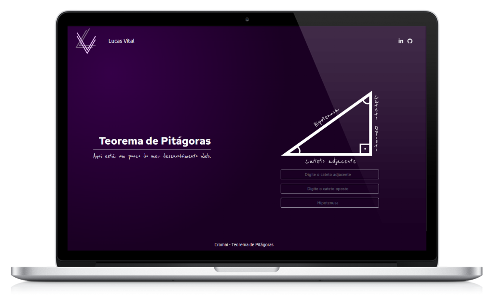

   

<h1 align="center">Teorema de Pitágoras</h1>

## 💻 Sobre o projeto

O projeto foi um desafio que recebi quando estava participando de um processo seletivo.

É uma aplicação simples para realizar o calculo da hipotenusa.

## 🛠 Tecnologias

-   **[React](https://pt-br.reactjs.org/)**
-   **[Bootstrap](https://getbootstrap.com/)**
-   **[Fort Awesome](https://fortawesome.com/)**